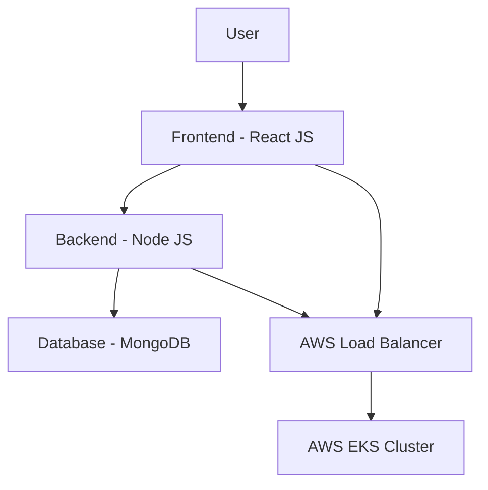

# Three-Tier Web Application Deployment on AWS EKS

## 🚀 Project Overview

This project demonstrates a complete deployment of a Three-Tier Web Application using modern DevOps practices, containerization, and cloud infrastructure. The application is built with React.js (Frontend), Node.js (Backend), and MongoDB (Database), and deployed on AWS Elastic Kubernetes Service (EKS).


## 🛠️ Tech Stack

- **Frontend:** React JS
- **Backend:** Node JS
- **Database:** MongoDB
- **Containerization:** Docker
- **Orchestration:** Kubernetes
- **Cloud Provider:** AWS
- **Container Registry:** AWS ECR


## Challenge Steps
- [Application Code](#application-code)
- [Jenkins Pipeline Code](#jenkins-pipeline-code)
- [Jenkins Server Terraform](#jenkins-server-terraform)
- [Kubernetes Manifests Files](#kubernetes-manifests-files)
- [Project Details](#project-details)

## Application Code
The `Application-Code` directory contains the source code for the Three-Tier Web Application. Dive into this directory to explore the frontend and backend implementations.

## Jenkins Pipeline Code
In the `Jenkins-Pipeline-Code` directory, you'll find Jenkins pipeline scripts. These scripts automate the CI/CD process, ensuring smooth integration and deployment of your application.

## Jenkins Server Terraform
Explore the `Jenkins-Server-TF` directory to find Terraform scripts for setting up the Jenkins Server on AWS. These scripts simplify the infrastructure provisioning process.

## Kubernetes Manifests Files
The `Kubernetes-Manifests-Files` directory holds Kubernetes manifests for deploying your application on AWS EKS. Understand and customize these files to suit your project needs.

🚢 **High-Level Overview:**
- IAM User setup & Terraform magic on AWS
- Jenkins deployment with AWS integration
- EKS Cluster creation & Load Balancer configuration
- Private ECR repositories for secure image management
- Helm charts for efficient monitoring setup
- GitOps with ArgoCD - the cherry on top!

## 📋 Project Architecture



## 🚢 Deployment Steps

### 1. IAM Configuration
- Create IAM user `eks-admin` with AdministratorAccess
- Generate Security Credentials (Access Key and Secret Access Key)

### 2. Development Environment Setup
1. Launch Ubuntu EC2 instance
2. Install required tools:
   ```bash
   # AWS CLI
   curl "https://awscli.amazonaws.com/awscli-exe-linux-x86_64.zip" -o "awscliv2.zip"
   sudo apt install unzip
   unzip awscliv2.zip
   sudo ./aws/install -i /usr/local/aws-cli -b /usr/local/bin --update
   
   # Docker
   sudo apt-get update
   sudo apt install docker.io
   sudo chown $USER /var/run/docker.sock

   # kubectl
   curl -o kubectl https://amazon-eks.s3.us-west-2.amazonaws.com/1.19.6/2021-01-05/bin/linux/amd64/kubectl
   chmod +x ./kubectl
   sudo mv ./kubectl /usr/local/bin

   # eksctl
   curl --silent --location "https://github.com/weaveworks/eksctl/releases/latest/download/eksctl_$(uname -s)_amd64.tar.gz" | tar xz -C /tmp
   sudo mv /tmp/eksctl /usr/local/bin
   ```

### 3. Container Creation
1. Create Dockerfiles for Frontend and Backend
2. Build Docker images
3. Push images to AWS ECR

### 4. Kubernetes Deployment
1. Create EKS Cluster
   ```bash
   eksctl create cluster --name three-tier-cluster --region us-west-2 --node-type t2.medium --nodes-min 2 --nodes-max 2
   ```

2. Create Kubernetes Manifests
   - Secrets for MongoDB credentials
   - Deployment files for Frontend, Backend, and MongoDB
   - Service definitions for internal communication

3. Apply Kubernetes Manifests
   ```bash
   kubectl create namespace workshop
   kubectl apply -f mongodb/
   kubectl apply -f backend/
   kubectl apply -f frontend/
   ```

### Step 1: IAM Configuration
- Create a user `eks-admin` with `AdministratorAccess`.
- Generate Security Credentials: Access Key and Secret Access Key.

### Step 2: EC2 Setup
- Launch an Ubuntu instance in your favourite region (eg. region `us-west-2`).
- SSH into the instance from your local machine.

### Step 3: Install AWS CLI v2
``` shell
curl "https://awscli.amazonaws.com/awscli-exe-linux-x86_64.zip" -o "awscliv2.zip"
sudo apt install unzip
unzip awscliv2.zip
sudo ./aws/install -i /usr/local/aws-cli -b /usr/local/bin --update
aws configure
```

### Step 4: Install Docker
``` shell
sudo apt-get update
sudo apt install docker.io
docker ps
sudo chown $USER /var/run/docker.sock
```

### Step 5: Install kubectl
``` shell
curl -o kubectl https://amazon-eks.s3.us-west-2.amazonaws.com/1.19.6/2021-01-05/bin/linux/amd64/kubectl
chmod +x ./kubectl
sudo mv ./kubectl /usr/local/bin
kubectl version --short --client
```

### Step 6: Install eksctl
``` shell
curl --silent --location "https://github.com/weaveworks/eksctl/releases/latest/download/eksctl_$(uname -s)_amd64.tar.gz" | tar xz -C /tmp
sudo mv /tmp/eksctl /usr/local/bin
eksctl version
```

### Step 7: Setup EKS Cluster
``` shell
eksctl create cluster --name three-tier-cluster --region us-west-2 --node-type t2.medium --nodes-min 2 --nodes-max 2
aws eks update-kubeconfig --region us-west-2 --name three-tier-cluster
kubectl get nodes
```

### Step 8: Run Manifests
``` shell
kubectl create namespace workshop
kubectl apply -f .
kubectl delete -f .
```

### Step 9: Install AWS Load Balancer
``` shell
curl -O https://raw.githubusercontent.com/kubernetes-sigs/aws-load-balancer-controller/v2.5.4/docs/install/iam_policy.json
aws iam create-policy --policy-name AWSLoadBalancerControllerIAMPolicy --policy-document file://iam_policy.json
eksctl utils associate-iam-oidc-provider --region=us-west-2 --cluster=three-tier-cluster --approve
eksctl create iamserviceaccount --cluster=three-tier-cluster --namespace=kube-system --name=aws-load-balancer-controller --role-name AmazonEKSLoadBalancerControllerRole --attach-policy-arn=arn:aws:iam::626072240565:policy/AWSLoadBalancerControllerIAMPolicy --approve --region=us-west-2
```

### Step 10: Deploy AWS Load Balancer Controller
``` shell
sudo snap install helm --classic
helm repo add eks https://aws.github.io/eks-charts
helm repo update eks
helm install aws-load-balancer-controller eks/aws-load-balancer-controller -n kube-system --set clusterName=my-cluster --set serviceAccount.create=false --set serviceAccount.name=aws-load-balancer-controller
kubectl get deployment -n kube-system aws-load-balancer-controller
kubectl apply -f full_stack_lb.yaml
```

### Cleanup
- To delete the EKS cluster:
``` shell
eksctl delete cluster --name three-tier-cluster --region us-west-2
```

### 5. Load Balancing and Routing
1. Install AWS Load Balancer Controller
2. Configure Ingress for routing traffic

## 🔍 Key Configurations

### MongoDB Deployment
- Uses official MongoDB image
- Secured with Kubernetes Secrets
- ClusterIP service for internal access

### Backend Configuration
- Environment variables for MongoDB connection
- Liveness and Readiness probes
- Rolling update strategy

### Frontend Configuration
- Uses ECR image
- Configurable backend URL

## 🛡️ Security Considerations
- IAM roles with least privilege
- Kubernetes network policies
- Secrets management
- Secure ECR repositories

## 🚀 Getting Started

1. Clone the repository
2. Configure AWS credentials
3. Follow deployment steps
4. Access the application via generated load balancer URL

## 🤝 Contributing

1. Fork the repository
2. Create feature branch
3. Commit your changes
4. Push to the branch
5. Create a Pull Request


## 🙌 Acknowledgments

- Inspiration from DevOps community
- Open-source tools and technologies

## 🎉 Happy Deploying!
